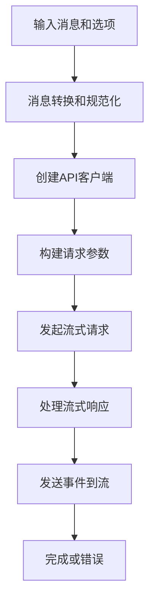

# Provider 模块详细说明

## 目录

- [概述](#概述)
- [目标API支持](#目标api支持)
- [实现细节](#实现细节)
- [API调用示例](#api调用示例)
- [错误处理](#错误处理)
- [性能考虑](#性能考虑)

## 概述

Provider 模块是 Nova AI SDK 的核心流式处理引擎，负责将标准化的 AI 消息转换为各个不同 API 提供商（如 OpenAI、Anthropic、Google等）的具体请求格式。该模块提供了高度模块化的设计，支持多种流式协议和多种认证方式。

### 主要特性

- **流式处理**: 支持 Server-Sent Events (SSE) 和 WebSocket 协议
- **多提供商支持**: OpenAI, Anthropic, Google, Amazon Bedrock 等
- **认证集成**: API 密钥、OAuth 令牌、Application Default Credentials
- **完整的事件系统**: 文本、思考、工具调用等多种事件类型
- **错误处理**: 富有表达力的异常处理机制

## 目标API支持

### 当前实现的 API

#### 1. OpenAI Completions API
- **文件**: `provider/openai_completions.py`
- **支持模型**: GPT-4.1、GPT-4、GPT-3.5、o1 系列
- **API 类型**: `openai-completions`
- **特性**: 推理能力、工具调用、图像输入

#### 2. 计划中的 API

- **OpenAI Responses API** (`openai-responses`)
- **Anthropic Messages API** (`anthropic-messages`)
- **Google Generative AI** (`google-generative-ai`)
- **Amazon Bedrock Converse Stream** (`bedrock-converse-stream`)
- **Google Vertex AI** (`google-vertex`)

### API 类型对比

| API 类型 | 推理支持 | 工具调用 | 图像输入 | 流式协议 |
|----------------|---------|----------|----------|----------|
| openai-completions | ✓ | ✓ | ✓ | SSE |
| openai-responses | ✓ | ✓ | ✓ | SSE |
| anthropic-messages | ✓ | ✓ | ✓ | SSE |
| google-generative-ai | ✗ | ✓ | ✓ | HTTP Stream |
| bedrock-converse-stream | ✗ | ✓ | ✗ | HTTP Stream |

## 实现细节

### 核心类和函数

#### `OpenAICompletionsOptions` 类

```python
class OpenAICompletionsOptions(StreamOptions):
    """OpenAI Completions 特定选项"""
    tool_choice: Optional[Union[str, Dict[str, Any]]] = None
    reasoning_effort: Optional[str] = None
```

#### 主要函数

1. **`stream_openai_completions()`** - 主流式处理函数
2. **`stream_simple_openai_completions()`** - 简化版本
3. **`convert_messages()`** - 消息格式转换
4. **`convert_tools()`** - 工具定义转换
5. **`create_client()`** - 创建API客户端
6. **`build_params()`** - 构建API请求参数

### 流式处理流程



### 消息转换规则

#### 文本内容
- 移除未配对的Unicode代理项对
- 保留有效的emoji和特殊字符

#### 思考内容
- 同模型：保留签名和加密内容
- 不同模型：转换为普通文本或删除

#### 工具调用
- ID规范化（适应不同API要求）
- 参数JSON流式解析
- 思考签名维护

#### 图像内容
- Base64编码转换
- MIME类型包装
- 模型能力检查

### 认证处理

#### API密钥获取

```python
def get_env_api_key(provider: str) -> Optional[str]:
    # GitHub Copilot特殊处理
    if provider == "github-copilot":
        return (os.environ.get("COPILOT_GITHUB_TOKEN") or 
                os.environ.get("GH_TOKEN") or 
                os.environ.get("GITHUB_TOKEN"))
    
    # Anthropic: OAuth令牌优先
    if provider == "anthropic":
        return os.environ.get("ANTHROPIC_OAUTH_TOKEN") or os.environ.get("ANTHROPIC_API_KEY")
    
    # 标准API密钥映射
    env_map = {
        "openai": "OPENAI_API_KEY",
        "google": "GEMINI_API_KEY",
        # ...其他提供商
    }
```

#### Application Default Credentials

- **Google Vertex AI**: `gcloud auth application-default login`
- **Amazon Bedrock**: AWS配置文件或环境变量

### 兼容性处理

#### 自动检测策略

```python
def detect_compat(model: Model) -> OpenAICompletionsCompat:
    """从提供商和baseUrl检测兼容性设置"""
    provider = model.provider
    base_url = model.base_url
    
    # 不同提供商的特殊要求
    is_zai = provider == "zai" or "api.z.ai" in base_url
    is_non_standard = (
        provider == "cerebras" or
        "cerebras.ai" in base_url or
        provider == "xai" or
        "api.x.ai" in base_url
    )
```

#### 兼容性覆盖

- **`supports_store`**: 是否支持 `store` 字段
- **`supports_developer_role`**: 是否支持 `developer` 角色
- **`thinking_format`**: 思考参数格式
- **`requires_mistral_tool_ids`**: Mistral工具ID格式要求

## API调用示例

### 基本使用

```python
import asyncio
from nova_ai.provider.openai_completions import stream_openai_completions
from nova_ai.core.messages import Context, UserMessage
from nova_ai.core.models import get_model

async def main():
    # 获取模型
    model = get_model("openai", "gpt-4.1")
    
    # 创建上下文
    context = Context(
        system_prompt="你是一个有用的助手",
        messages=[
            UserMessage(content="你好，请问今天天气怎么样？")
        ]
    )
    
    # 发起流式请求
    stream = await stream_openai_completions(model, context)
    
    # 处理流式响应
    async for event in stream:
        if event.type == "text_delta":
            print(event.delta, end="", flush=True)
        elif event.type == "done":
            print("\n\n完成")

if __name__ == "__main__":
    asyncio.run(main())
```

### 带工具调用的高级使用

```python
from nova_ai.core.messages import Tool
from nova_ai.provider.openai_completions import OpenAICompletionsOptions

# 定义工具
weather_tool = Tool(
    name="get_weather",
    description="获取指定城市的天气信息",
    parameters={
        "type": "object",
        "properties": {
            "city": {"type": "string"}
        },
        "required": ["city"]
    }
)

# 设置工具选项
options = OpenAICompletionsOptions(
    tool_choice={"type": "function", "function": {"name": "get_weather"}}
)

# 调用带工具的API
stream = await stream_openai_completions(model, context, options)
```

### 使用思考能力

```python
from nova_ai.core.enums import ThinkingLevel
from nova_ai.utils.stream_options import SimpleStreamOptions

# 设置思考级别
options = SimpleStreamOptions(
    reasoning=ThinkingLevel.HIGH,
    thinking_budgets=ThinkingBudgets(high=8192)
)

# 调用带思考的API
stream = await stream_simple_openai_completions(model, context, options)
```

## 错误处理

### 异常类型

1. **API认证错误**: `ValueError` - API密钥不存在成格式不正确
2. **流式协议错误**: `Exception` - SSE连接或数据解析错误
3. **请求参数错误**: `ValueError` - 无效的模型或请求参数
4. **网络错误**: `IOError` - 网络连接或超时错误

### 错误处理示例

```python
try:
    stream = await stream_openai_completions(model, context, options)
    
    async for event in stream:
        if event.type == "error":
            print(f"错误发生: {event.error.error_message}")
            break
        # 处理其他事件
            
except ValueError as e:
    print(f"请求参数错误: {e}")
except Exception as e:
    print(f"网络或API错误: {e}")
```

### 重试机制

```python
from tenacity import retry, stop_after_attempt, wait_exponential

@retry(
    stop=stop_after_attempt(3),
    wait=wait_exponential(multiplier=1, min=4, max=10)
)
async def robust_api_call(model, context, options):
    return await stream_openai_completions(model, context, options)
```

## 性能考虑

### 内存优化

1. **流式处理**: 避免整个响应在内存中缓存
2. **对象复用**: 使用 `copy.deepcopy()` 避免对象修改
3. **字符串处理**: 使用正则表达式实现高效的代理项清理

### 网络性能

1. **连接池**: 建议使用HTTP连接池
2. **超时设置**: 根据API提供商设置合适的超时
3. **压缩**: 支持gzip压缩传输

### 缓存策略

1. **ADC缓存**: Google Vertex AI的Application Default Credentials缓存
2. **API密钥缓存**: 环境变量缓存
3. **模型定义缓存**: 模型注册表缓存

### 监控和调试

1. **请求加密**: 支持请求加密回调
2. **流式调试**: 可观察流式事件流
3. **应用统计**: 使用统计数据进行性能分析

## 扩展指南

### 添加新的API提供商

1. 创建新的provider文件（例如 `provider/anthropic_messages.py`）
2. 实现核心流式处理函数
3. 添加消息转换逻辑
4. 注册到模型注册表

### 自定义认证方式

1. 继承基础认证类
2. 实现具体的认证逻辑
3. 注册到认证处理器

### 性能调优

1. **并发控制**: 使用主机上的并发限制
2. **缓存策略**: 实现请求缓存和响应缓存
3. **资源管理**: 连接池和内存管理

---

*文档更新日期: 2026-03-05*
*版本: 1.0.0*